## 🏡 Global Airbnb Performance Dashboard

## 📌 Project Overview

This project is an interactive Power BI Dashboard that analyzes Airbnb's global marketplace across multiple cities. The dashboard explores market share, pricing, customer satisfaction, host trust, customer behavior, and seasonal demand to generate actionable business insights.

---

## Dasboard Preview

## 🏠 Home Page

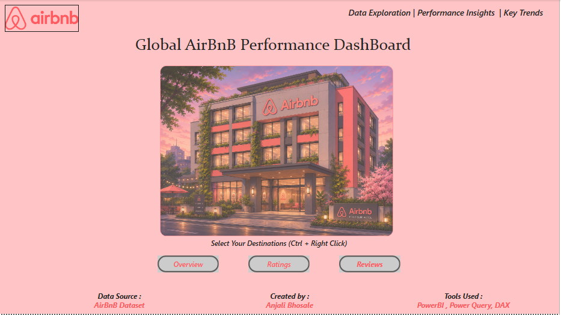

## 📊 Overview Dashboard

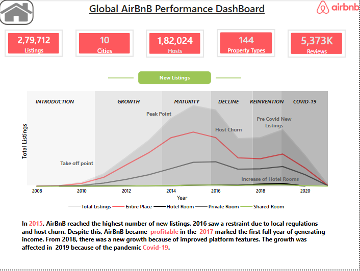

## ⭐ Ratings Dashboard

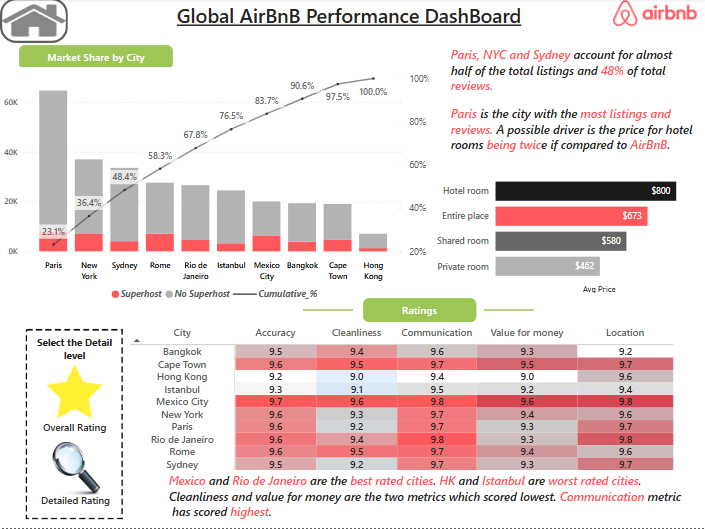

## 📝 Reviews Dashboard

## 🎯 Business Questions & Answers

## Q1. How large is Airbnb's presence across major global cities?

✅ Answer

Airbnb has built a strong global presence across multiple cities.

- 279,712 Listings
- 182,024 Hosts
- 144 Property Types
- 10 Cities
- 537.3K Reviews.

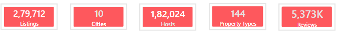

---

## Q2. How has Airbnb grown over time?

✅ Answer

The listing growth trend shows:

Rapid expansion between 2012–2015
Peak growth in 2015
Growth slowed after 2016 due to regulations and host churn
COVID-19 impacted listing growth during 2020

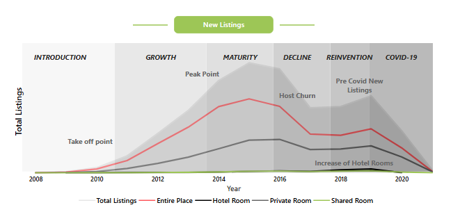

--- 

## Q3. Which cities contribute the most to Airbnb's business?

✅ Answer

Paris contributes the largest share of Airbnb listings followed by New York and Sydney. Together these cities account for nearly half of Airbnb's total listings.
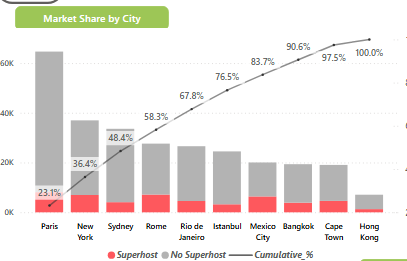

---

## Q4. Is Airbnb's market concentrated or evenly distributed?

✅ Answer

The Pareto analysis shows that a small number of cities contribute most Airbnb listings, indicating a concentrated market.

---

## Q5. Which property type is the most expensive?

✅ Answer

Hotel Rooms are the most expensive property type, while Shared Rooms are the most affordable.
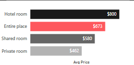

---

## Q6. Why might travelers prefer Airbnb over hotels?

✅ Answer

Entire Place listings are considerably cheaper than Hotel Rooms while offering greater privacy, making Airbnb an attractive option.

---

## Q7. Which cities deliver the best customer experience?

✅ Answer

Mexico City and Rio de Janeiro achieved the highest ratings, whereas Hong Kong and Istanbul received comparatively lower ratings.
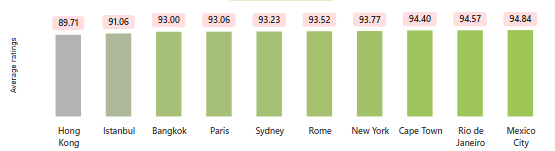

---

## Q8. Which rating category needs improvement?

✅ Answer

Communication consistently scores the highest, while Cleanliness and Value for Money have comparatively lower ratings.
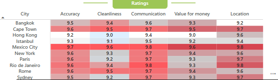

---

## Q9. Does higher supply always result in better ratings?

✅ Answer

No. Cities with the largest number of listings do not necessarily receive the highest customer ratings, demonstrating that customer experience matters more than supply alone.

---

## Q10. How often do customers leave reviews?

✅ Answer

Most customers leave reviews three times or fewer, while only a few highly active users contribute a very large number of reviews.
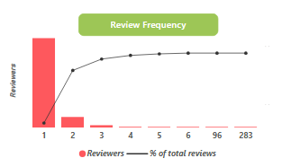 

---

## Q11. Can review frequency be used as a measure of customer engagement?

✅ Answer

Yes. Review frequency highlights customer engagement patterns and identifies highly active reviewers and outliers.

---

## Q12. How trustworthy are Airbnb hosts?

✅ Answer

Over two-thirds of Airbnb hosts have completed identity verification, while only a very small percentage remain anonymous, indicating strong platform trust.
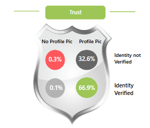

---

## Q13. Which cities experience seasonal demand?

✅ Answer

Paris and Rome maintain consistent demand throughout the year, whereas New York experiences noticeable spikes during holiday seasons.
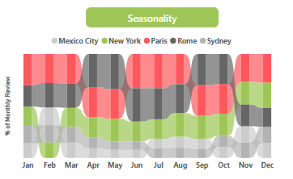

---

## 🛠 Tools Used

- Power BI
- Power Query
- DAX
- Data Modeling
- Interactive Navigation
- Data Visualization

---

## 📈 Skills Demonstrated

- Data Cleaning
- Data Modeling
- Power Query
- DAX Measures
- Dashboard Design
- KPI Development
- Business Analysis
- Data Storytelling
- Interactive Reporting

---

## 🙏 Acknowledgements

A special thanks to Mansi Goel for her excellent guidance and mentorship throughout this project. Her tutorials on Power BI, dashboard design, and business storytelling were instrumental in helping me successfully complete this project.

---

## 👩‍💻 Author

Anjali Bhosale

Data Analyst Intern | Power BI | SQL | Excel | Python

---
